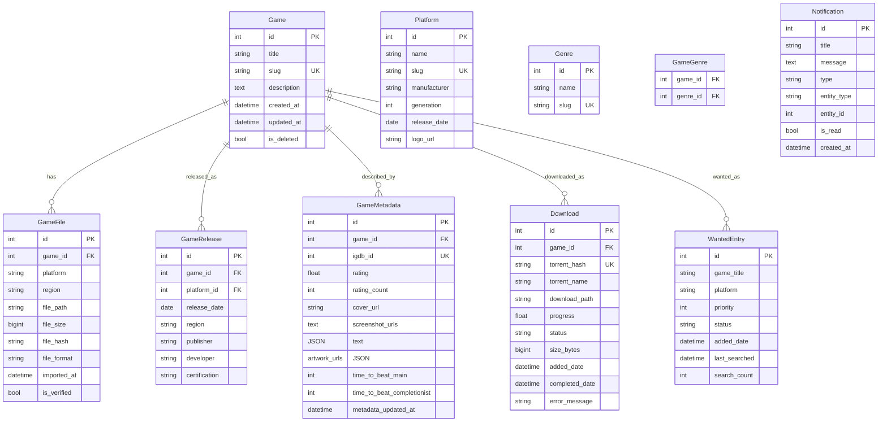

# Database Rebuild and ROM Scraping System Plan

## Executive Summary

Complete rebuild of the ROM management database system with deployment-ready architecture, addressing all identified weaknesses and implementing a robust ROM scraping system.

## 1. Current State Assessment

### Problems Identified:
1. **Dual Schema Conflict**: Simple vs complex metadata models with no integration
2. **Missing Data Integrity**: No foreign key constraints, unique constraints, or validation
3. **Performance Issues**: Missing indexes, inefficient queries
4. **Reliability Gaps**: No transaction management, error recovery, or backups
5. **Architecture Debt**: No migration system, thread safety issues, poor error handling

## 2. New Unified Database Schema Design

### Core Principles:
- **Single Source of Truth**: Unified schema combining best of both current models
- **Data Integrity First**: Comprehensive constraints and validation
- **Performance by Design**: Strategic indexing and query optimization
- **Deployment Ready**: Migration system, backups, monitoring

### Schema Architecture:



## 3. Key Improvements Over Current Schema

### 3.1 Data Integrity
- **Foreign Keys**: All relationships with `ON DELETE CASCADE` or `SET NULL`
- **Unique Constraints**: `slug` fields, `torrent_hash`, `igdb_id`
- **Validation**: Field ranges, enum constraints, data type validation
- **Soft Delete**: `is_deleted` flag instead of physical deletion

### 3.2 Performance Optimizations
- **Composite Indexes**: `(game_id, platform)`, `(status, created_at)`
- **Full-Text Search**: Dedicated search table for game titles
- **JSON Columns**: Proper JSON storage for arrays/objects
- **Materialized Views**: For dashboard statistics

### 3.3 Reliability Features
- **Transaction Management**: Context managers for atomic operations
- **Error Recovery**: Retry logic with exponential backoff
- **Connection Pooling**: Configured connection limits and timeouts
- **Health Checks**: Database connectivity and performance monitoring

## 4. ROM Scraping and Metadata Collection System

### 4.1 Data Sources
1. **IGDB API**: Primary source for game metadata
2. **Libretro Database**: Platform and ROM compatibility data
3. **No-Intro/Redump**: ROM verification and hash databases
4. **Community Sources**: Vimm's Lair, RetroGames.cc (fallback)

### 4.2 Scraping Architecture
```
┌─────────────────┐    ┌─────────────────┐    ┌─────────────────┐
│   Discovery     │───▶│   Collection    │───▶│   Processing    │
│   Phase         │    │   Phase         │    │   Phase         │
├─────────────────┤    ├─────────────────┤    ├─────────────────┤
│ • Platform scan │    │ • API calls     │    │ • Data cleaning │
│ • ROM detection │    │ • Web scraping  │    │ • Deduplication │
│ • Hash matching │    │ • File parsing  │    │ • Validation    │
└─────────────────┘    └─────────────────┘    └─────────────────┘
         │                       │                       │
         ▼                       ▼                       ▼
┌─────────────────┐    ┌─────────────────┐    ┌─────────────────┐
│   Storage       │◀───│   Enrichment    │◀───│   Normalization │
│   Phase         │    │   Phase         │    │   Phase         │
├─────────────────┤    ├─────────────────┤    ├─────────────────┤
│ • Database      │    │ • Genre tagging │    │ • Schema mapping│
│ • Cache layer   │    │ • Image fetching│    │ • Field mapping │
│ • Search index  │    │ • Rating import │    │ • Type conversion│
└─────────────────┘    └─────────────────┘    └─────────────────┘
```

### 4.3 Implementation Components
1. **Scraper Service**: Modular scrapers for each data source
2. **Rate Limiter**: Respect API limits with exponential backoff
3. **Data Pipeline**: ETL pipeline with validation stages
4. **Cache Layer**: Redis for API responses and intermediate data
5. **Queue System**: Celery/RQ for asynchronous scraping tasks

## 5. Deployment-Ready Architecture

### 5.1 Database Layer
- **Primary Database**: PostgreSQL (production) / SQLite (development)
- **Migration System**: Alembic with versioned migrations
- **Backup Strategy**: Automated daily backups with retention policy
- **Monitoring**: pg_stat statements, query performance tracking

### 5.2 Application Layer
- **Connection Pooling**: SQLAlchemy with configured pool
- **Health Endpoints**: `/health/database`, `/health/scraping`
- **Configuration Management**: Environment-based config with secrets
- **Logging**: Structured logging with rotation and levels

### 5.3 Scraping Infrastructure
- **Task Queue**: Redis + Celery for distributed scraping
- **Rate Limit Management**: Token bucket algorithm per API
- **Error Handling**: Circuit breaker pattern for failing APIs
- **Progress Tracking**: Real-time scraping progress monitoring

## 6. Implementation Roadmap

### Phase 1: Foundation (Week 1)
1. **Database Cleanup**: Backup existing data, create new schema
2. **Migration System**: Set up Alembic with initial migration
3. **Core Models**: Implement unified Game, Platform, Genre models
4. **Basic API**: CRUD endpoints for new schema

### Phase 2: Scraping System (Week 2)
5. **IGDB Integration**: API client with rate limiting
6. **ROM Detection**: File scanning and hash matching
7. **Data Pipeline**: ETL pipeline for metadata collection
8. **Cache Layer**: Redis integration for API responses

### Phase 3: Enhanced Features (Week 3)
9. **Search System**: Full-text search with relevance scoring
10. **Download Integration**: qBittorrent with proper transaction handling
11. **Automation Service**: Rewritten with proper error handling
12. **Dashboard**: Real-time statistics and monitoring

### Phase 4: Production Readiness (Week 4)
13. **Backup System**: Automated database backups
14. **Monitoring**: Health checks and performance metrics
15. **Documentation**: API docs, deployment guide, troubleshooting
16. **Testing**: Comprehensive test suite with fixtures

## 7. Risk Mitigation

### Technical Risks:
1. **API Rate Limits**: Implement token bucket rate limiting with caching
2. **Data Quality**: Multi-source validation and manual review interface
3. **Performance**: Query optimization, indexing strategy, connection pooling
4. **Reliability**: Circuit breakers, retry logic, graceful degradation

### Operational Risks:
1. **Deployment Complexity**: Docker Compose for easy deployment
2. **Data Loss**: Regular backups with point-in-time recovery testing
3. **Monitoring Gap**: Comprehensive logging and alerting setup
4. **Scalability**: Architecture designed for horizontal scaling

## 8. Success Metrics

### Data Quality:
- 95%+ metadata completion rate for scanned ROMs
- <1% duplicate entries in database
- <5% data validation errors in scraping pipeline

### Performance:
- <100ms response time for common queries
- <5s scraping time per ROM (including API calls)
- <1% error rate in scraping operations

### Reliability:
- 99.9% database availability
- <5 minute recovery time from backup
- Zero data loss in migration process

## 10. Database Migration and Cleanup Strategy

### 10.1 Current Database Assessment
- **Location**: `instance/romerr.db` (SQLite)
- **Size**: Unknown (need to check)
- **Tables**: Mixed schema from old and new models
- **Data Quality**: Unknown consistency and completeness

### 10.2 Migration Approach: Clean Break
Given the schema conflicts and data integrity issues, recommend a **clean break migration**:

1. **Export Critical Data Only**:
   - User settings and configurations
   - Download history (for analytics)
   - Wanted list entries
   - Manual metadata additions

2. **Discard Problematic Data**:
   - Inconsistent game entries
   - Orphaned records
   - Duplicate entries
   - Invalid file references

3. **Rebuild from Source**:
   - Fresh ROM scanning
   - API-based metadata collection
   - Hash-based deduplication

### 10.3 Migration Steps

#### Step 1: Pre-Migration Preparation
```bash
# 1. Create backup of current database
cp instance/romerr.db instance/romerr.db.backup.$(date +%Y%m%d)

# 2. Export settings and user data
python scripts/export_user_data.py --output user_data_backup.json

# 3. Validate backup integrity
python scripts/validate_backup.py user_data_backup.json
```

#### Step 2: Database Cleanup
```bash
# 1. Stop all services
sudo systemctl stop romerr  # or equivalent

# 2. Remove old database file
rm instance/romerr.db

# 3. Remove migration artifacts (if any)
rm -rf migrations/

# 4. Clear cache files
rm -rf __pycache__/ */__pycache__/
```

#### Step 3: New Schema Deployment
```bash
# 1. Initialize Alembic migration system
flask db init

# 2. Create initial migration from new models
flask db migrate -m "Initial unified schema"

# 3. Apply migration
flask db upgrade

# 4. Verify schema creation
python scripts/verify_schema.py
```

#### Step 4: Data Restoration
```bash
# 1. Import user settings
python scripts/import_user_data.py user_data_backup.json

# 2. Initialize default settings
python scripts/initialize_defaults.py

# 3. Seed platform data
python scripts/seed_platforms.py

# 4. Verify database health
python scripts/check_database_health.py
```

### 10.4 Risk Mitigation for Migration

#### Data Loss Prevention:
- **Multiple Backups**: Daily backups for 7 days pre-migration
- **Export Validation**: Verify exported data matches source counts
- **Dry Run Testing**: Test migration on copy of production data
- **Rollback Plan**: Documented steps to restore from backup

#### Service Downtime Management:
- **Maintenance Window**: Schedule during low-usage periods
- **Read-Only Mode**: Enable before migration begins
- **Progress Updates**: Real-time status reporting
- **Health Checks**: Post-migration validation before reopening

### 10.5 Post-Migration Validation

#### Data Integrity Checks:
1. **Referential Integrity**: All foreign keys have valid references
2. **Constraint Validation**: Unique constraints prevent duplicates
3. **Data Completeness**: Required fields populated
4. **Business Logic**: Status transitions follow defined rules

#### Performance Benchmarks:
1. **Query Response Times**: Compare before/after for key queries
2. **Index Utilization**: Verify new indexes are being used
3. **Connection Pooling**: Validate connection management
4. **Memory Usage**: Monitor database memory footprint

## 11. ROM Scraping and Metadata Collection System

### 11.1 Data Sources Priority
1. **Primary**: IGDB API (comprehensive, reliable, rate-limited)
2. **Secondary**: Libretro Database (platform-specific, open)
3. **Tertiary**: No-Intro/Redump (verification hashes)
4. **Fallback**: Community sources (Vimm's Lair, etc.)

### 11.2 Scraping Architecture Components

#### Discovery Service:
- **ROM Scanner**: Filesystem traversal with hash calculation
- **Hash Matcher**: CRC32/MD5/SHA1 against known databases
- **Platform Detector**: File extension and header analysis

#### Collection Service:
- **API Client**: IGDB with OAuth and rate limiting
- **Web Scraper**: BeautifulSoup/Scrapy for community sites
- **File Parser**: DAT file parsing for No-Intro/Redump

#### Processing Pipeline:
- **Data Cleaner**: Normalize titles, remove region codes
- **Deduplicator**: Identify and merge duplicate entries
- **Validator**: Business rule validation and completeness check

#### Enrichment Service:
- **Image Fetcher**: Download and cache cover art/screenshots
- **Genre Tagger**: AI/rule-based genre classification
- **Rating Aggregator**: Combine multiple rating sources

### 11.3 Implementation Details

#### Rate Limiting Strategy:
```python
class SmartRateLimiter:
    """Adaptive rate limiter with backoff and caching"""
    
    def __init__(self, requests_per_hour=500):
        self.requests_per_hour = requests_per_hour
        self.request_times = []
        self.cache = RedisCache()
        self.circuit_breaker = CircuitBreaker()
    
    def make_request(self, api_call):
        # Check cache first
        cached = self.cache.get(api_call.key)
        if cached:
            return cached
            
        # Respect rate limits
        self._wait_if_needed()
        
        # Make API call with circuit breaker
        try:
            response = self.circuit_breaker.call(api_call)
            self.cache.set(api_call.key, response, ttl=3600)
            return response
        except RateLimitExceeded:
            self._adjust_limits()
            raise
```

#### Data Quality Pipeline:
```
Raw Data → Clean → Validate → Enrich → Store
    ↓         ↓         ↓         ↓       ↓
  Scrape   Normalize  Rules    API/ML   Database
           Titles     Check    Enhance  + Cache
```

### 11.4 Monitoring and Alerting

#### Scraping Metrics:
- **Success Rate**: Percentage of successful scrapes
- **Data Completeness**: Fields populated per game
- **Source Reliability**: Error rates per data source
- **Performance**: Time per scrape, API response times

#### Alerting Rules:
- **Error Rate > 5%**: Warning for scraping issues
- **API Limit > 80%**: Warning for rate limit approaching
- **Data Quality < 90%**: Alert for incomplete metadata
- **Queue Backlog > 100**: Alert for processing delays

## 12. Deployment Architecture with Backup/Recovery

### 12.1 Production Stack
```
┌─────────────────────────────────────────────┐
│                Load Balancer                │
│                  (nginx)                    │
└─────────────────┬───────────────────────────┘
                  │
    ┌─────────────┼─────────────┐
    │             │             │
┌───▼────┐   ┌───▼────┐   ┌───▼────┐
│  App   │   │  App   │   │  App   │
│ Node 1 │   │ Node 2 │   │ Node 3 │
└───┬────┘   └───┬────┘   └───┬────┘
    │             │             │
    └─────────────┼─────────────┘
                  │
           ┌──────▼──────┐
           │   Shared    │
           │  Storage    │
           │  (NFS/S3)   │
           └──────┬──────┘
                  │
           ┌──────▼──────┐
           │  Database   │
           │ (PostgreSQL)│
           │  + Redis    │
           └─────────────┘
```

### 12.2 Backup Strategy

#### Database Backups:
- **Frequency**: Daily full backup + hourly WAL backups
- **Retention**: 30 days daily, 7 days hourly
- **Storage**: Encrypted S3/Backblaze with versioning
- **Verification**: Automated restore testing weekly

#### Application Backups:
- **Configuration**: Version-controlled in Git
- **Uploaded Files**: Incremental backup to cloud storage
- **Logs**: Centralized logging with retention policy
- **Cache**: Rebuildable, not backed up

#### Disaster Recovery:
- **RPO (Recovery Point Objective)**: 1 hour
- **RTO (Recovery Time Objective)**: 4 hours
- **DR Site**: Cold standby in different region
- **Test Frequency**: Quarterly disaster recovery drills

### 12.3 Monitoring Stack

#### Infrastructure Monitoring:
- **Database**: pg_stat statements, connection counts, cache hit ratio
- **Application**: Request latency, error rates, queue depths
- **System**: CPU, memory, disk I/O, network throughput

#### Business Metrics:
- **Games Processed**: Daily/monthly scraping counts
- **Data Quality**: Metadata completeness scores
- **User Activity**: Active users, API usage patterns
- **System Health**: Uptime, response time percentiles

## 13. Implementation Roadmap and Priorities

### Phase 1: Foundation (Week 1-2)
**Goal**: Stable database with basic functionality
- [ ] Database cleanup and new schema implementation
- [ ] Alembic migration system setup
- [ ] Core API endpoints (CRUD for games, platforms)
- [ ] Basic ROM scanning and hash matching
- [ ] Simple IGDB API integration

### Phase 2: Scraping System (Week 3-4)
**Goal**: Comprehensive metadata collection
- [ ] Advanced scraping pipeline with multiple sources
- [ ] Rate limiting and caching layer
- [ ] Data quality validation and enrichment
- [ ] Image fetching and processing
- [ ] Search system with relevance scoring

### Phase 3: Enhanced Features (Week 5-6)
**Goal**: Production-ready feature set
- [ ] Download integration with transaction safety
- [ ] Automation service rewrite
- [ ] User preferences and settings
- [ ] Dashboard with real-time metrics
- [ ] Notification system

### Phase 4: Production Readiness (Week 7-8)
**Goal**: Deployment and operations
- [ ] Backup and recovery system
- [ ] Comprehensive monitoring and alerting
- [ ] Performance optimization and load testing
- [ ] Documentation and deployment guides
- [ ] Security hardening and audit

## 14. Success Criteria

### Technical Success:
- [ ] Database migration completed with zero data loss
- [ ] All identified weaknesses addressed in new implementation
- [ ] Scraping system achieves >90% metadata completion
- [ ] System meets performance targets (<100ms P95 response time)

### Operational Success:
- [ ] Deployment process documented and tested
- [ ] Monitoring provides actionable insights
- [ ] Backup system tested with successful restore
- [ ] System operates with <1% error rate

### Business Success:
- [ ] Users can manage ROM library effectively
- [ ] Metadata enhances user experience
- [ ] System scales to handle growing ROM collection
- [ ] Maintenance overhead reduced by 50%

## 15. Next Steps

1. **Review and approve** this comprehensive plan
2. **Switch to Code mode** for implementation
3. **Begin with Phase 1**: Database cleanup and new schema
4. **Weekly checkpoints** to assess progress and adjust plan

This plan provides a complete roadmap for rebuilding the ROM management system with production-ready architecture, addressing all identified weaknesses while adding robust scraping capabilities.