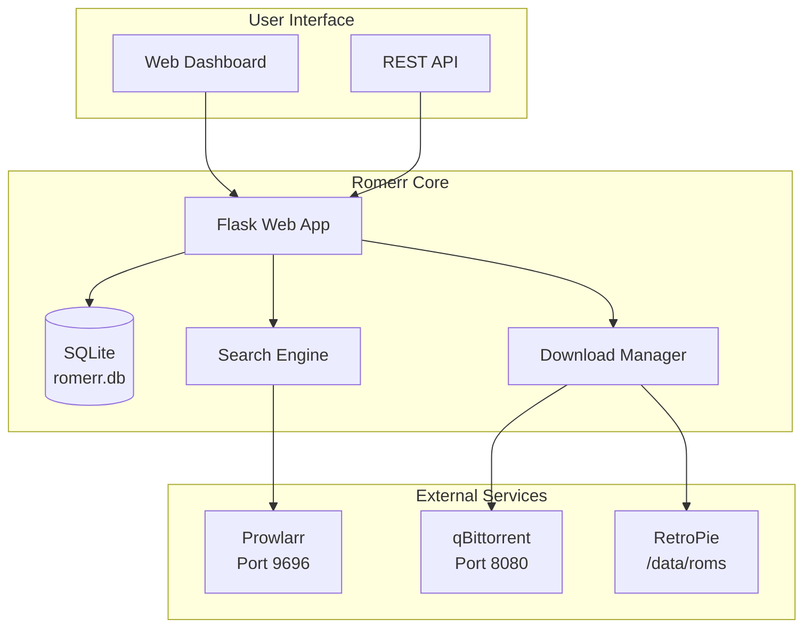

# Romerr: Automated ROM Management System - Implementation Plan

## Project Overview
Romerr is a self-hosted, Sonarr/Radarr-style management platform for retro games. It provides a "search-to-play" pipeline by integrating with torrent indexers and clients to automate the discovery and organization of ROMs for RetroPie and other emulators.

## Core Architecture



## Phase 1: Core Flask Backend + SQLite Database + Basic Web UI

### 1.1 Project Structure
```
/home/calvin/Documents/romerr/
├── app.py                    # Main Flask application
├── requirements.txt          # Python dependencies
├── .env                      # Environment variables
├── .gitignore
├── config/
│   ├── __init__.py
│   ├── config.py            # Configuration management
│   └── constants.py         # Application constants
├── models/
│   ├── __init__.py
│   ├── game.py              # Game model
│   ├── wanted.py            # Wanted list model
│   └── download.py          # Download tracking model
├── routes/
│   ├── __init__.py
│   ├── api.py               # REST API endpoints
│   └── web.py               # Web UI routes
├── services/
│   ├── __init__.py
│   ├── database.py          # Database service
│   └── search.py            # Search service (stub)
├── static/
│   ├── css/
│   │   └── style.css        # Modern hacker aesthetic
│   ├── js/
│   │   └── main.js          # Frontend JavaScript
│   └── images/
└── templates/
    ├── base.html            # Base template
    ├── index.html           # Dashboard
    ├── wanted.html          # Wanted games list
    └── downloads.html       # Downloads management
```

### 1.2 Database Schema Design

#### Games Table
```sql
CREATE TABLE games (
    id INTEGER PRIMARY KEY AUTOINCREMENT,
    title TEXT NOT NULL,
    platform TEXT NOT NULL,
    region TEXT,
    release_year INTEGER,
    file_path TEXT,
    file_size INTEGER,
    added_date TIMESTAMP DEFAULT CURRENT_TIMESTAMP,
    last_played TIMESTAMP,
    play_count INTEGER DEFAULT 0,
    status TEXT DEFAULT 'library'  -- 'library', 'wanted', 'downloading', 'failed'
);
```

#### Wanted List Table
```sql
CREATE TABLE wanted_games (
    id INTEGER PRIMARY KEY AUTOINCREMENT,
    game_title TEXT NOT NULL,
    platform TEXT NOT NULL,
    region_preference TEXT,
    quality_preference TEXT,
    added_date TIMESTAMP DEFAULT CURRENT_TIMESTAMP,
    priority INTEGER DEFAULT 1,
    status TEXT DEFAULT 'pending'  -- 'pending', 'searching', 'found', 'failed'
);
```

#### Downloads Table
```sql
CREATE TABLE downloads (
    id INTEGER PRIMARY KEY AUTOINCREMENT,
    game_id INTEGER REFERENCES games(id),
    torrent_hash TEXT,
    torrent_name TEXT,
    download_path TEXT,
    size_bytes INTEGER,
    progress REAL DEFAULT 0.0,
    status TEXT DEFAULT 'queued',  -- 'queued', 'downloading', 'completed', 'failed'
    added_date TIMESTAMP DEFAULT CURRENT_TIMESTAMP,
    completed_date TIMESTAMP
);
```

### 1.3 Flask Application Structure

#### Main Application (`app.py`)
```python
from flask import Flask
from flask_sqlalchemy import SQLAlchemy
from flask_migrate import Migrate
from config.config import Config

db = SQLAlchemy()
migrate = Migrate()

def create_app(config_class=Config):
    app = Flask(__name__)
    app.config.from_object(config_class)
    
    db.init_app(app)
    migrate.init_app(app, db)
    
    # Register blueprints
    from routes.web import web_bp
    from routes.api import api_bp
    
    app.register_blueprint(web_bp)
    app.register_blueprint(api_bp, url_prefix='/api')
    
    return app
```

#### Configuration (`config/config.py`)
```python
import os
from dotenv import load_dotenv

load_dotenv()

class Config:
    SECRET_KEY = os.environ.get('SECRET_KEY') or 'dev-secret-key-change-in-production'
    SQLALCHEMY_DATABASE_URI = os.environ.get('DATABASE_URL') or 'sqlite:///romerr.db'
    SQLALCHEMY_TRACK_MODIFICATIONS = False
    
    # Prowlarr configuration
    PROWLARR_URL = os.environ.get('PROWLARR_URL', 'http://localhost:9696')
    PROWLARR_API_KEY = os.environ.get('PROWLARR_API_KEY', '')
    
    # qBittorrent configuration
    QBITTORRENT_URL = os.environ.get('QBITTORRENT_URL', 'http://localhost:8080')
    QBITTORRENT_USERNAME = os.environ.get('QBITTORRENT_USERNAME', 'admin')
    QBITTORRENT_PASSWORD = os.environ.get('QBITTORRENT_PASSWORD', 'adminadmin')
    
    # ROMs path
    ROMS_PATH = os.environ.get('ROMS_PATH', '/data/roms')
```

### 1.4 Frontend Design Specifications

#### Color Palette
- Primary Green: `#3ecf6e`
- Accent Orange: `#e8871a`
- Background Dark: `#0a0a0a`
- Terminal Text: `#00ff00`
- Card Background: `#1a1a1a`

#### Dashboard Components
1. **Header**: Logo + Navigation (Dashboard, Wanted, Downloads, Settings)
2. **Stats Cards**: 
   - Total Games in Library
   - Games Wanted
   - Active Downloads
   - Storage Usage
3. **Recent Activity**: Timeline of recent actions
4. **Wanted Games**: Quick add form + list
5. **Download Queue**: Progress bars for active downloads

### 1.5 Dependencies (`requirements.txt`)
```
Flask==2.3.3
Flask-SQLAlchemy==3.0.5
Flask-Migrate==4.0.5
requests==2.31.0
python-qbittorrent==0.4.3
python-dotenv==1.0.0
Werkzeug==2.3.7
```

## Phase 2: API Integrations (Prowlarr + qBittorrent)

### 2.1 Prowlarr Integration
- Search endpoint: `/api/v1/indexers/all/search`
- Query parameters: `query`, `categories` (4000 for Games)
- Response parsing for torrent results
- Scoring logic for region/quality matching

### 2.2 qBittorrent Integration
- Authentication with cookie-based session
- Torrent addition via `.torrent` files or magnet links
- Category assignment: `romerr-roms`
- Download path configuration
- Progress monitoring via WebSocket or polling

### 2.3 Search-to-Download Pipeline
1. User adds game to wanted list
2. Scheduled job searches Prowlarr
3. Best result selected based on scoring
4. Torrent added to qBittorrent with category
5. Download progress tracked in database
6. On completion, file moved to ROMs path
7. Game status updated to "library"

## Phase 3: Docker Containerization

### 3.1 Dockerfile
```dockerfile
FROM python:3.11-slim

WORKDIR /app

COPY requirements.txt .
RUN pip install --no-cache-dir -r requirements.txt

COPY . .

RUN mkdir -p /data/roms

ENV FLASK_APP=app.py
ENV FLASK_ENV=production

EXPOSE 5000

CMD ["gunicorn", "--bind", "0.0.0.0:5000", "app:create_app()"]
```

### 3.2 docker-compose.yml
```yaml
version: '3.8'

services:
  romerr:
    build: .
    ports:
      - "5000:5000"
    volumes:
      - ./romerr.db:/app/romerr.db
      - ./config:/app/config
      - roms_data:/data/roms
    environment:
      - DATABASE_URL=sqlite:////app/romerr.db
      - ROMS_PATH=/data/roms
      - SECRET_KEY=${SECRET_KEY}
    restart: unless-stopped

volumes:
  roms_data:
```

## Phase 4: Advanced Features

### 4.1 Multi-user Support
- User authentication system
- Role-based permissions (admin, user)
- Personal wanted lists and libraries

### 4.2 Metadata Integration
- IGDB API for game metadata
- Cover art downloading
- Game descriptions and ratings

### 4.3 RetroPie Integration
- Automatic library refresh triggers
- Scraper integration for box art
- Emulation station compatibility

## Implementation Timeline

### Week 1: Core Foundation
- Day 1-2: Flask setup + database models
- Day 3-4: Basic web UI with dashboard
- Day 5: Configuration management

### Week 2: API Integrations
- Day 6-7: Prowlarr search implementation
- Day 8-9: qBittorrent download management
- Day 10: Search-to-download pipeline

### Week 3: Polish & Deployment
- Day 11-12: Docker configuration
- Day 13: Testing and bug fixes
- Day 14: Documentation and deployment

## Next Steps

1. **Review this plan** - Confirm architecture and priorities
2. **Switch to Code mode** - Begin implementation of Phase 1
3. **Iterative development** - Build, test, and refine each component
4. **Integration testing** - Connect with external services
5. **Deployment** - Containerize and deploy to production environment

## Success Metrics
- ✅ Games can be added to wanted list via web UI
- ✅ Automatic search and download of ROMs
- ✅ Download progress visible in real-time
- ✅ Completed games appear in library
- ✅ System runs in Docker container
- ✅ Modern hacker aesthetic implemented